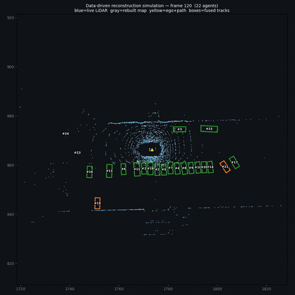
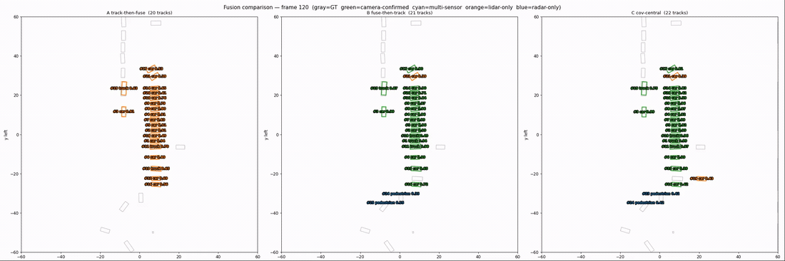
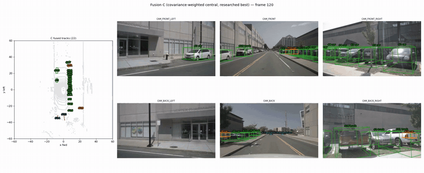

# Multi-Modal Sensor Fusion for Autonomous Driving

[](https://github.com/jralbino/Sensor-fusion/actions/workflows/ci.yml)
[](https://www.python.org/)
[](LICENSE)

Multi-modal autonomous-driving perception system with four modules: **LiDAR** (3D detection + tracking), **Vision** (2D detection + lane segmentation + tracking), **Radar** (3D detection), and **Fusion** (LiDAR-to-camera projection **+ decision-level late fusion of LiDAR + camera + radar**). Uses NuScenes mini for 3D and BDD100K for 2D.

Highlights:
- **Decision-level late fusion** combining LiDAR (3D geometry), camera (classification) and radar (velocity) in the bird's-eye-view frame — designed to run in **6 GB of GPU** where feature-level fusion (e.g. BEVFusion) does not fit. Three architectures (track-then-fuse, fuse-then-track, covariance-weighted central) are implemented, scored against NuScenes GT and rendered to video.
- **Per-modality + cross-modality tracking** with a dependency-free ByteTrack (2D + 3D) shared across modules.
- **Reproducible**: one Docker container per dependency stack, or per-module Python 3.11 venvs.

<p align="center">
  <br>
  <em>Data-driven scene reconstruction (digital twin): the static world is rebuilt by accumulating the LiDAR cloud in the global frame, with the ego vehicle and fused-tracked agents replayed through it.</em>
</p>

## Modules

### LiDAR — 3D Object Detection & Tracking

Detects 10 object classes in 3D LiDAR point clouds using pillar-based voxelization and 2D/sparse CNN backbones.

| Model | Description | Params |
|-------|-------------|--------|
| **PointPillars** | Dense 2D CNN backbone, anchor-based head | 4.0M |
| **SECOND** | Sparse 2D CNN (spconv), same head | 2.1M |
| **CenterPoint** | Dense backbone, anchor-free heatmap head | 4.4M |
| **MMDet3D wrappers** | Pretrained PointPillars/SECOND/CenterPoint from MMDetection3D | — |

Pipeline: Raw points → Voxelization (0.16m pillars) → VFE → Backbone → Detection head → NMS → Boxes (x,y,z,l,w,h,yaw).

Multi-frame **ByteTrack** tracking with ego-motion compensation and Kalman-filtered 3D states.

Visualizations: BEV (PNG), interactive 3D (Plotly HTML), 6-camera projection (PNG), and Streamlit dashboard.

See [Lidar/README.md](Lidar/README.md) for full details.

### Vision — 2D Object Detection & Lane Segmentation

Compares multiple SOTA detectors and lane models on BDD100K driving images.

| Task | Models |
|------|--------|
| **Object Detection** | YOLO26 (L/X), YOLO11 (L/X), RT-DETR (X / L, BDD-finetuned, people-finetuned) |
| **Lane Detection** | YOLOP (BDD100K pretrained), UFLD (CULane / TuSimple), PolyLaneNet |

UFLD improvements: min-points filter + polynomial smoothing suppress spurious detections. UFLD (CULane) is recommended for BDD100K's diverse urban scenes.

Multi-frame **ByteTrack** tracking for consistent object IDs across video sequences.

App supports three modes: **Live Demo** (BDD100K images), **NuScenes** (6-camera grid with detections), and **Benchmarks**.

See [Vision/README.md](Vision/README.md) for full details.

### Radar — Radar Point Cloud Detection

Detects objects in NuScenes radar point clouds (5 radars fused, 6 features per point: x, y, z, rcs, vx_comp, vy_comp).

| Model | Approach | Description |
|-------|----------|-------------|
| **CFAR + DBSCAN** | Classical signal processing | Range-ordered CFAR thresholding + DBSCAN clustering + heuristic classification |
| **RadarPillars** | Deep learning | PointPillars-style pillar VFE adapted for radar (0.5m voxels, 200m range) |
| **RadarCenterPoint** | Deep learning | Heatmap-based anchor-free detection for radar |

Includes Streamlit app (`app.py`), CLI pipeline (`main.py`), NuScenes dataset loader, and 59 unit tests.

See [Radar/README.md](Radar/README.md) for full details.

### Fusion — Decision-Level Late Fusion (LiDAR + Camera + Radar)

Two parts:

1. **LiDAR → camera projection** (`src/lidar_to_camera.py`) — projects LiDAR 3D points onto camera images using NuScenes calibration (extrinsics + intrinsics), demonstrating cross-sensor spatial alignment.
2. **Decision-level (late) fusion** (`src/late_fusion/`) — runs each sensor's own detector and combines the *detections* in the BEV frame, so it fits in 6 GB and reuses every existing detector. LiDAR provides the 3D boxes (anchors), camera confirms/refines the class (projection-IoU association), and radar supplies velocity / moving objects.

Three fusion architectures are implemented and compared (`multimodal.py`):

| Architecture | Idea |
|---|---|
| **A — track-then-fuse** | Track each modality independently (camera ×6, LiDAR, radar), then fuse the tracks |
| **B — fuse-then-track** | Fuse all sensors' raw detections per frame, then track the fused result |
| **C — cov-weighted central** | Like B, but principled: covariance-weighted radar/LiDAR position fusion (range-dependent noise) + Bayesian log-odds existence (radar down-weighted) — the literature-recommended setup |

**Does fusion help? — ablation** over all 10 NuScenes-mini scenes (404 frames, mean±std; greedy BEV matching to GT, 2 m gate):

| config | recall | precision | F1 | ΔF1 vs LiDAR-only |
|---|---|---|---|---|
| LiDAR-only | 0.42±0.13 | 0.72±0.15 | 0.51±0.12 | base |
| + Camera | 0.43±0.12 | 0.72±0.14 | 0.52±0.11 | +0.007 |
| + Camera + Radar | 0.44±0.11 | 0.70±0.15 | 0.52±0.10 | +0.006 |

The official LiDAR detector is already strong, so the gains on a single class-agnostic F1 are small — camera adds **recall** + class refinement at no precision cost; classical radar adds a little recall but costs some precision. Fusion's real value here is the extra recall, class refinement and **velocity** (a learned radar detector + per-class metrics would widen the margins — see roadmap).

**Architecture comparison** (same 10-scene protocol, mean±std + pooled micro-F1):

| arch | recall | precision | F1 | tracks | micro-F1 |
|---|---|---|---|---|---|
| **A track-then-fuse** | **0.49** | 0.63 | 0.53 | 102 | **0.551** |
| B fuse-then-track | 0.44 | **0.70** | 0.52 | **74** | 0.528 |
| C cov-weighted central | 0.47 | 0.68 | **0.54** | 80 | 0.541 |

A precision/recall trade-off, not a single winner: **A** maximises recall/micro-F1 (but noisiest), **B** maximises precision with the cleanest tracks, **C** is the best balance (top macro-F1) and a sensible default. *(Evaluating across many scenes flipped the single-scene impression that B won — exactly why the multi-scene protocol matters.)* 37 pure-NumPy unit tests cover the fusion core. The forward cameras also carry a YOLOP lane / drivable-area overlay (`fusion_video.py`, `--no-lanes` to disable).

<p align="center">
  <br>
  <em>A | B | C side-by-side (BEV): gray = ground truth, coloured boxes = fused tracks (green = camera-confirmed, cyan = multi-sensor, orange = LiDAR-only, blue = radar-only).</em>
</p>

<p align="center">
  <br>
  <em>Fusion C (covariance-weighted central): BEV with track IDs (left) and the fused 3D boxes projected onto all six surround cameras (right), with a YOLOP lane / drivable-area overlay on the forward cameras.</em>
</p>

Full method write-up and module usage in **[Fusion/README.md](Fusion/README.md)**.

### Tracking — ByteTrack Multi-Object Tracking

Shared `tracking/` module used by both LiDAR (3D) and Vision (2D) pipelines.

- Two-threshold association (high/low confidence) with Hungarian matching
- 2D Kalman filter (8-dim state: cx, cy, aspect_ratio, h + velocities)
- 3D Kalman filter (10-dim state: x, y, z, l, w, h, yaw + velocities)
- Axis-aligned BEV IoU for 3D, standard IoU for 2D
- No external dependencies beyond numpy + scipy

## Installation

Each module has its own Python 3.11 virtual environment with pinned dependencies in `requirements.txt`.

### Vision Module

```bash
cd Vision
python3.11 -m venv venv
source venv/bin/activate
pip install -r requirements.txt
```

### LiDAR Module (needs spconv, nuscenes-devkit, CUDA)

```bash
cd Lidar
python3.11 -m venv venv
source venv/bin/activate
pip install -r requirements.txt
```

### Radar Module

```bash
cd Radar
python3.11 -m venv venv
source venv/bin/activate
pip install -r requirements.txt
```

### Data Setup

- **NuScenes mini**: Download from [nuscenes.org](https://www.nuscenes.org/nuscenes#download) → extract to `Fusion/data/sets/nuscenes/`
- **BDD100K**: Validation images → `Vision/data/raw/bdd100k/images/100k/val/`

## Quick Start

```bash
# --- LiDAR ---
# Prepare data (generates pickle info files)
Lidar/venv/bin/python Lidar/scripts/prepare_data.py \
    --data-root Fusion/data/sets/nuscenes --version v1.0-mini

# Single-scene detection + visualization
Lidar/venv/bin/python Lidar/main.py \
    --data-root Fusion/data/sets/nuscenes \
    --model mmdet3d_pointpillars --sample-idx 0

# Multi-frame tracking (BEV PNGs with track IDs + trajectories)
Lidar/venv/bin/python Lidar/main.py \
    --data-root Fusion/data/sets/nuscenes \
    --model mmdet3d_pointpillars --sample-idx 0 \
    --track --num-frames 10

# Training
Lidar/venv/bin/python Lidar/train_simple.py \
    --data-root Fusion/data/sets/nuscenes \
    --model pointpillars --num-epochs 20 --batch-size 2

# Streamlit dashboard (BEV, 3D, cameras, tracking)
cd Lidar && venv/bin/streamlit run app.py

# --- Vision ---
# Interactive Streamlit app (detection + lanes + tracking)
Vision/venv/bin/streamlit run Vision/app.py

# Batch processing with videos
Vision/venv/bin/python Vision/main.py

# Batch tracking (outputs tracked JSON)
Vision/venv/bin/python Vision/main.py --track --limit 50

# --- Radar ---
# Classical detector (no GPU needed)
Radar/venv/bin/python Radar/main.py \
    --data-root Fusion/data/sets/nuscenes --model cfar_dbscan

# Radar Streamlit app
Radar/venv/bin/streamlit run Radar/app.py

# --- Fusion ---
# LiDAR -> camera projection
Lidar/venv/bin/python Fusion/src/lidar_to_camera.py

# Decision-level late fusion — A/B/C comparison (metrics table + 3-panel BEV video)
docker compose run --rm fusion python Fusion/fusion_compare.py --start-idx 120 --num-frames 41

# Per-modality + per-architecture fusion videos
docker compose run --rm fusion python Fusion/fusion_video.py --start-idx 120 --num-frames 41

# Data-driven scene reconstruction / simulation
docker compose run --rm fusion python Fusion/simulation_video.py --start-idx 120 --num-frames 41

# Fusion unit tests (29, pure NumPy)
docker compose run --rm fusion python -m pytest Fusion/tests/ -v

# --- Tests ---
Lidar/venv/bin/python -m pytest tracking/tests/ -v   # 22 tracking tests
Lidar/venv/bin/python -m pytest Lidar/tests/ -v
Vision/venv/bin/python -m pytest Vision/tests/ -v    # 32 unit + 14 integration
Radar/venv/bin/python -m pytest Radar/tests/ -v      # 59 tests
```

## Configuration

All paths are managed through `config/config.yaml` → `config/utils/path_manager.py` (PathManager singleton). Paths are relative to the project root.

## Project Structure

```
Sensor-fusion/
├── Lidar/                  # 3D LiDAR detection module (own venv)
│   ├── app.py              # Streamlit dashboard (BEV / 3D / cameras / tracking)
│   ├── main.py             # Detection + tracking pipeline
│   ├── train_simple.py     # Training with TensorBoard + cosine LR
│   ├── evaluate.py         # mAP + NDS evaluation
│   ├── visualize.py        # BEV visualization (track IDs + trajectories)
│   ├── visualize_3d.py     # 3D interactive + 6-camera projection + multi-sweep
│   └── src/                # Models, losses, data loading
├── Vision/                 # 2D detection module (own venv)
│   ├── app.py              # Streamlit app (Live Demo / NuScenes / Benchmarks)
│   ├── main.py             # Batch inference + tracking
│   ├── dashboard_app.py    # Benchmark analysis dashboard
│   ├── run_benchmark.py    # Performance benchmarks
│   ├── debug_polylanenet.py # GT vs PolyLaneNet diagnostic tool
│   └── src/                # Detectors, lane models, utilities
├── Radar/                  # Radar detection module (own venv)
│   ├── app.py              # Streamlit app
│   ├── main.py             # CLI detection pipeline
│   ├── src/                # CFAR+DBSCAN, RadarPillars, RadarCenterPoint
│   └── tests/              # 59 unit tests
├── Fusion/                 # LiDAR-camera projection + decision-level late fusion
│   ├── src/lidar_to_camera.py   # LiDAR -> camera projection
│   ├── src/late_fusion/    # Late fusion core (types/geometry/association/fusion/multimodal)
│   ├── fusion_compare.py   # A/B/C comparison (metrics + 3-panel BEV video)
│   ├── fusion_video.py     # Per-modality + per-architecture videos
│   ├── simulation_video.py # Data-driven scene reconstruction
│   ├── fusion_evaluate.py  # Multi-scene evaluation + sensor ablation
│   ├── tests/              # 37 fusion unit tests
│   └── README.md           # Full method write-up + results
├── tracking/               # ByteTrack MOT (shared by Lidar + Vision)
│   ├── bytetrack.py        # Core two-threshold association + Hungarian matching
│   ├── kalman_2d.py        # 2D Kalman filter (8-dim state)
│   ├── kalman_3d.py        # 3D Kalman filter (10-dim state)
│   ├── tracker_2d.py       # ByteTracker2D (xyxy boxes)
│   ├── tracker_3d.py       # ByteTracker3D (7-param boxes, BEV IoU)
│   └── tests/              # 22 unit tests
├── config/                 # Centralized path management
│   ├── config.yaml         # All paths + model filenames
│   └── utils/path_manager.py  # PathManager singleton
├── docker/                 # Per-stack Dockerfiles + docker-compose.yml
├── LICENSE                 # MIT
└── README.md
```

## Author

**Jorge Rojas**

[](https://www.linkedin.com/in/jrojascontrol/)

## License

Released under the [MIT License](LICENSE).
