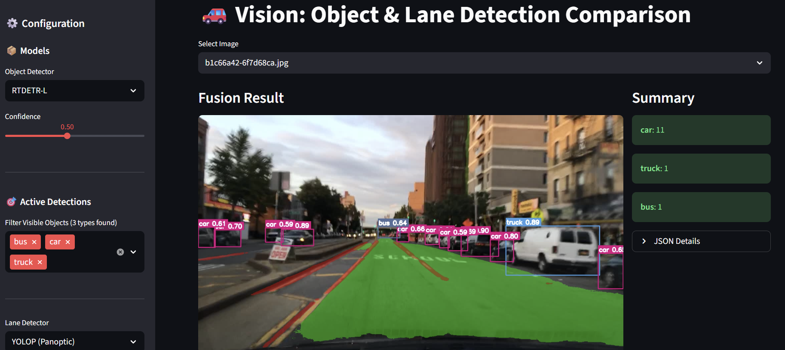

# 👁️ Vision Module

This module contains the implementation of Computer Vision algorithms for object detection and lane segmentation using SOTA (State-of-the-Art) models. It is fully integrated with the project's centralized `PathManager` for robust and consistent path handling.

## 📸 Demo


## 📂 Structure
*   `app.py`: Interactive Streamlit application for real-time demos or testing with static images.
*   `main.py`: Script for batch inference processing and comparative video generation.
*   `dashboard_app.py`: Streamlit dashboard for comprehensive analysis of benchmark results and generated videos.
*   `run_benchmark.py`: Script to run model benchmarks and generate performance metrics.
*   `src/`: Source code for the detectors (YOLO, RT-DETR, YOLOP, etc.) and other utilities.
*   `models/`: Folder where model weights (.pt, .pth) should reside, as configured in `config/config.yaml`.

## 🚀 Setup & Execution

### 1. Prerequisites
Ensure you have Python 3.9+ and a virtual environment set up. For a full project setup, please refer to the main `README.md` in the project root.

### 2. Install Dependencies
All project dependencies, including those specific to the Vision module, are installed by running the following command from the **project root directory** (after activating your virtual environment):
```bash
pip install -e ".[vision,lidar,fusion]"
```
This ensures all necessary packages for Vision (and other modules) are available.

### 3. Data Setup (BDD100K)
The module utilizes the BDD100K dataset. Ensure your validation images are located at the path specified by `path_manager.get("bdd_images_val")` (default: `Vision/data/raw/bdd100k/images/100k/val`).
If this directory does not exist or is empty, the demo application may not display sample images.

### 4. Model Downloads
This project relies on several pre-trained models. Please refer to the **main project's `README.md`** for a comprehensive list of required models, their download links, and their designated locations within the `Vision/models/` directory. The `PathManager` uses these configurations to locate your models.

### 5. Running the Applications

**Important:** Always activate your virtual environment before running any scripts. Streamlit applications are best run from the project root directory.

#### a) Interactive Interface (Streamlit App)
To launch the interactive graphical interface for real-time testing and model comparison:
```bash
# From the project root directory:
streamlit run Vision/app.py
```

#### b) Batch Processing & Video Generation
To run inference in batch mode and generate comparative videos (without benchmarks):
```bash
# From the project root directory:
python Vision/main.py
```
*(You can modify the configuration files (`Vision/config/*.yaml`) to specify subsets of images or other processing parameters.)*

#### c) Benchmarking
To run model benchmarks and generate performance analysis JSON files:
```bash
# From the project root directory:
python Vision/run_benchmark.py
```

#### d) Analysis Dashboard
To view comprehensive benchmark results, generated videos, and detailed prediction analysis:
```bash
# From the project root directory:
streamlit run Vision/dashboard_app.py
```
